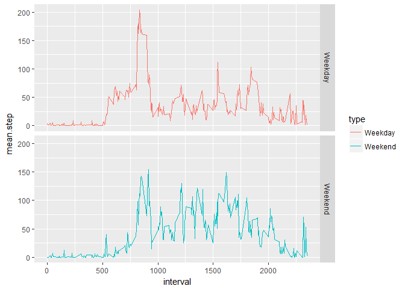

# Reproducible Research: Peer Assessment 1

## Introduction

It is now possible to collect a large amount of data about personal movement using activity monitoring devices such as a Fitbit, Nike Fuelband, or Jawbone Up. These type of devices are part of the "quantified self" movement - a group of enthusiasts who take measurements about themselves regularly to improve their health, to find patterns in their behavior, or because they are tech geeks. But these data remain under-utilized both because the raw data are hard to obtain and there is a lack of statistical methods and software for processing and interpreting the data.

This assignment makes use of data from a personal activity monitoring device. This device collects data at 5 minute intervals through out the day. The data consists of two months of data from an anonymous individual collected during the months of October and November, 2012 and include the number of steps taken in 5 minute intervals each day.

 The data for this assignment can be downloaded from the course web site:

- Dataset: Activity monitoring data [52K]
- URL: https://d396qusza40orc.cloudfront.net/repdata%2Fdata%2Factivity.zip

The variables included in this dataset are:

- steps: Number of steps taking in a 5-minute interval (missing values are coded as NA)
- date: The date on which the measurement was taken in YYYY-MM-DD format
- interval: Identifier for the 5-minute interval in which measurement was taken

The dataset is stored in a comma-separated-value (CSV) file and there are a total of 17,568 observations in this dataset.


## Loading and preprocessing the data
**1. Load the data (i.e. read.csv())**  
Load required libraries:

```r
library(data.table)
library(dplyr)
library(ggplot2)
library(mice)
```

Set directory:

```r
setwd('C:/Users/Jae/Desktop/JHU - Data Science/5 _ Reproducible Research/Week2')
```

Download and unzip the file:

```r
url <- 'https://d396qusza40orc.cloudfront.net/repdata%2Fdata%2Factivity.zip'

download.file(url, destfile = './activity.zip')

unzip(zipfile = './activity.zip')
```
  
**2. Process/transform the data (if necessary) into a format suitable for your analysis**  
Create a data table:

```r
activity <- data.table(read.csv('./activity.csv'))
```
  
  
## What is mean total number of steps taken per day?
**For this part of the assignment, you can ignore the missing values in the dataset.**  

**1. Calculate the total number of steps taken per day** 
**2. If you do not understand the difference between a histogram and a barplot, research the difference between them. Make a histogram of the total number of steps taken each day**  
Create a data table grouping by date and add a column of total steps per a day:

```r
day <- data.table(activity %>% group_by(date) %>%
                         summarise(tot.step = sum(steps, na.rm = T)))
```

Remove NAs:

```r
valid_act <- subset(day, tot.step != 0)
```

Histogram:

```r
ggplot(valid_act, aes(tot.step)) + geom_histogram(bins = 20)
```

<!-- -->
  
**3. Calculate and report the mean and median of the total number of steps taken per day**  
Mean:

```r
mean.act <- mean(valid_act$tot.step)

mean.act
```

```
## [1] 10766.19
```

Median:

```r
med.act <- median(valid_act$tot.step)

med.act
```

```
## [1] 10765
```


## What is the average daily activity pattern?
**1. Make a time series plot (i.e. type = "l") of the 5-minute interval (x-axis) and the average number of steps taken, averaged across all days (y-axis)**  
Create a data table grouping by interval and add a column of average steps per day:

```r
day_int <- data.table(activity %>% group_by(interval) %>% 
                             summarise(avg.step = mean(steps, na.rm = T)))
```

Time series plot:

```r
ggplot(day_int, aes(interval, avg.step)) + geom_line(stat = 'identity')
```

<!-- -->

**2. Which 5-minute interval, on average across all the days in the dataset, contains the maximum number of steps?**  
Maximum average step:

```r
max_int <- max(day_int$avg.step, na.rm = T)
max_interval <- subset(day_int, avg.step == max_int)

max_interval
```

```
##    interval avg.step
## 1:      835 206.1698
```


## Imputing missing values
**Note that there are a number of days/intervals where there are missing values (coded as NA). The presence of missing days may introduce bias into some calculations or summaries of the data.**  

**1. Calculate and report the total number of missing values in the dataset (i.e. the total number of rows with NAs)**  
Count the number of missing steps:

```r
imp <- activity

imp <- imp[, missing.steps := is.na(steps)]

imp[, .N, missing.steps]
```

```
##    missing.steps     N
## 1:          TRUE  2304
## 2:         FALSE 15264
```

There are 2304 missing values in the 'step' column.  

**2. Devise a strategy for filling in all of the missing values in the dataset. The strategy does not need to be sophisticated. For example, you could use the mean/median for that day, or the mean for that 5-minute interval, etc.**  
Fill out the missing values using 'multivariate imputation by chained equations' function:

```r
fill <- mice(activity, printFlag=FALSE)
```
  
**3. Create a new dataset that is equal to the original dataset but with the missing data filled in.**  
Create a data table grouping by date and add a column of total steps per a day:

```r
nAct <- data.table(complete(fill))
nAct$date <- as.Date(nAct$date, '%Y-%m-%d')

nAct_day <- data.table(nAct %>% group_by(date) %>%
                              summarise(tot.Steps = sum(steps)))
```
  
**4. Make a histogram of the total number of steps taken each day and Calculate and report the mean and median total number of steps taken per day.**  
Histogram:

```r
step_hist <- ggplot(nAct_day, aes(tot.Steps)) + geom_histogram(bins= 20)

step_hist
```

<!-- -->

Mean:

```r
mean.nAct <- mean(nAct_day$tot.Steps)

mean.nAct
```

```
## [1] 10323.11
```

Median:

```r
med.nAct <- median(nAct_day$tot.Steps)

med.nAct
```

```
## [1] 10395
```


**Do these values differ from the estimates from the first part of the assignment? What is the impact of imputing missing data on the estimates of the total daily number of steps?**  
Before and after imputation:

```r
m.step <- matrix(nrow=2, ncol=2, 
                 dimnames=list(c("Original","Imputed"),
                               c("mean","median")))

m.step[1,1] <- mean.act
m.step[1,2] <- med.act
m.step[2,1] <- mean.nAct
m.step[2,2] <- med.nAct

m.step
```

```
##              mean median
## Original 10766.19  10765
## Imputed  10323.11  10395
```

There is a slight difference between the original and the imputed data. Mean and median vary according to the values created by the "mice" package. The feature of "mice" is powerful to understand the pattern of missing data that it is one of good ways to avoid introducing bias. I believe, by imputing missing values, it prevents reductions in efficiency and makes the analysis of data easier.

## Are there differences in activity patterns between weekdays and weekends?
**For this part the weekdays() function may be of some help here. Use the dataset with the filled-in missing values for this part.**  

**1. Create a new factor variable in the dataset with two levels - "weekday" and "weekend" indicating whether a given date is a weekday or weekend day.**  
Create a new data table separating weekdays and weekends:

```r
activity.day <- data.table(nAct %>% mutate(weekdays = weekdays(nAct$date)))

day <- subset(activity.day, weekdays != 'Saturday' & weekdays != 'Sunday')
end <- subset(activity.day, weekdays == 'Saturday' | weekdays == 'Sunday')

iday <- data.table(day %>% group_by(interval) %>%
                          summarise(mean.step = mean(steps)))
iend <- data.table(end %>% group_by(interval) %>%
                          summarise(mean.step = mean(steps)))


iday <- data.table(iday %>% mutate(type = 'Weekday'))
iend <- data.table(iend %>% mutate(type = 'Weekend'))

comb <- rbind(iday, iend)
```

**2. Make a panel plot containing a time series plot (i.e. type = "l") of the 5-minute interval (x-axis) and the average number of steps taken, averaged across all weekday days or weekend days (y-axis). See the README file in the GitHub repository to see an example of what this plot should look like using simulated data.**  
Compare average steps for every interval on weekdays and weekend:

```r
compare1 <- ggplot(comb, aes(interval, mean.step, color = type)) + 
       geom_line(stat = 'identity') +
       facet_grid(type~.)

compare1
```

<!-- -->

Duplicate the plots on a same panel:

```r
compare2 <- ggplot(comb, aes(interval, mean.step, color = type)) + 
       geom_line(stat = 'identity')

compare2
```

<!-- -->


